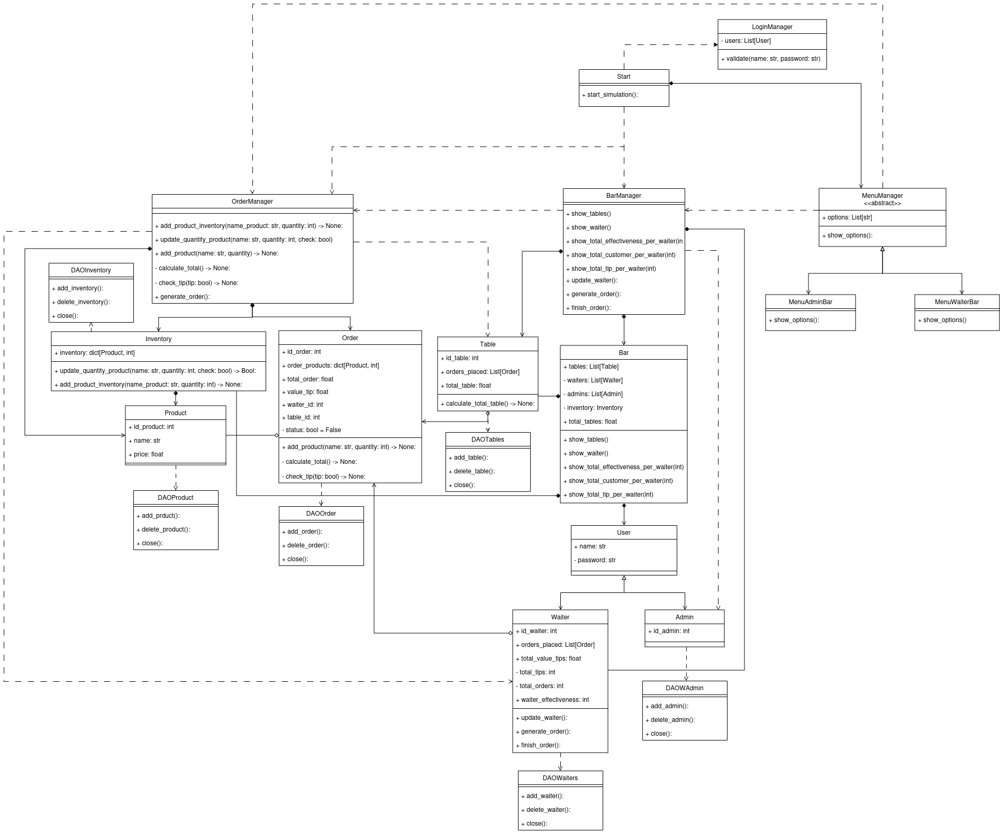

# **Bar_Proyect**

## Description from the practice

- The application will allow users (bar manager and waiters) to record orders for each table in the bar, including drinks and food. Waiters will be able to record orders with products and quantities, and settle invoices for customers to pay. Managers will have the ability to analyze the work of the waiters, including the number of customers served and the profit in tips. Additionally, managers will be able to graphically visualize, using a matrix, the bar tables and their total active expenses.

## Functional Requirements

- **Order Entry**
    - Waiters must be able to record customer orders specifying products and quantities.
    - Orders must be associated to a specific table.

- **Invoice Settlement**
    - Waiters must be able to settle invoices for orders so that customers can pay.
    - The settlement must include the calculation of tips (Tips will be 10%).

- **Analysis of waiter's work**
    - Managers should be able to view the number of customers served by each waiter.
    - Managers should be able to see how much the waiters have earned in tips.
    - Managers should be able to evaluate the effectiveness of the waiters.

- **Table Visualization**
    - Managers should be able to graphically visualize, using a matrix, the tables in the bar and their total active spend.

- **Inventory Control**
    - The system should manage the bar's inventory, guaranteeing the availability of products when orders are generated, avoiding the sale of products without stock.

- **User Management**
    - The system must manage the user login (administrator or waiter) also provides a menu of options accordingly.

## UML Diagram Class
- url: https://drive.google.com/file/d/1klMp5p3ypNC_fg-_QSDYqmc7Rv4gzxJE/view?usp=sharing
- image: 
